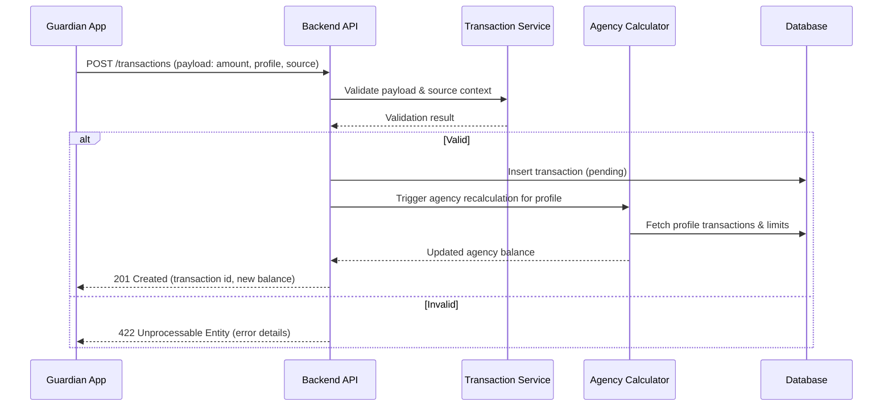

# Flow: Add Transaction

**Notes:**
- Split transactions invoke this flow once per allocation, referencing a parent transaction id.
- Validation includes credit limit checks when `source_type` is `card_purchase`.
