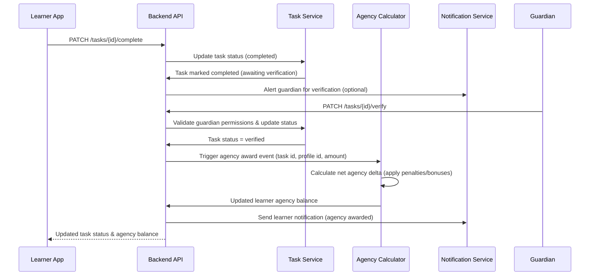

# Flow: Award Task-Based Agency

**Notes:**
- If verification times out, the flow reverts to pending and no agency is granted.
- Optional automation rules may auto-verify based on evidence uploads or integrations.
