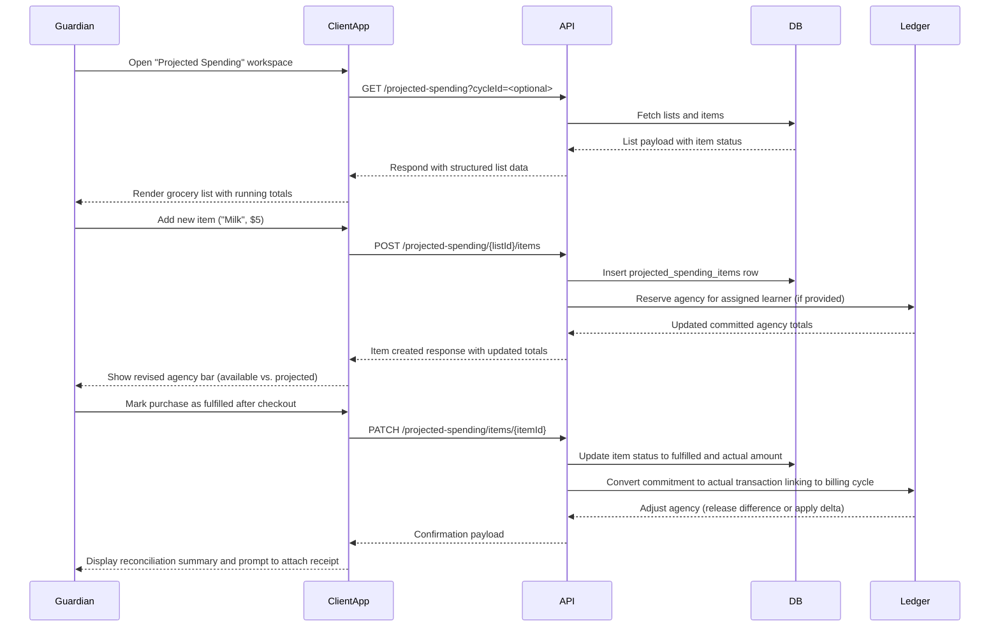

# Flow: Manage Projected Spending Lists

This sequence diagram captures how guardians plan and adjust itemized projected spending so agency reflects upcoming obligations.

## Notes
- API should return aggregated totals per list to keep the UI responsive without recalculating client-side.
- Ledger interactions must reconcile partial fulfillment—if the actual amount differs from the estimate, adjust the learner's agency accordingly.
- Support collaborative editing by locking lists during concurrent sessions or implementing optimistic updates with conflict resolution payloads.
