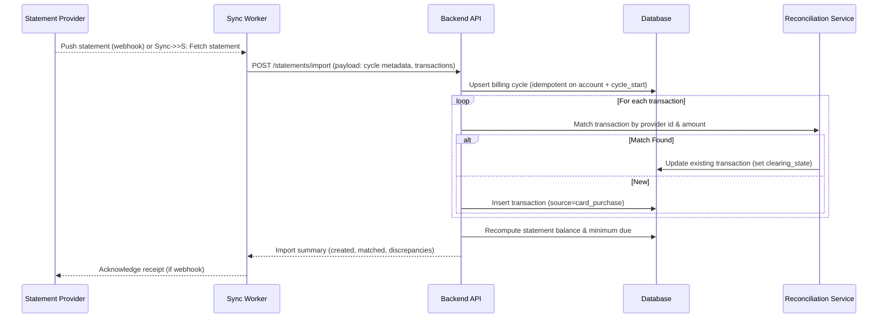

# Flow: Sync Credit Card Statement

**Notes:**
- Reconciliation flags discrepancies (amount mismatch, missing learner profile) for manual review.
- Cycle state transitions to `statement_issued` once the sync completes.
