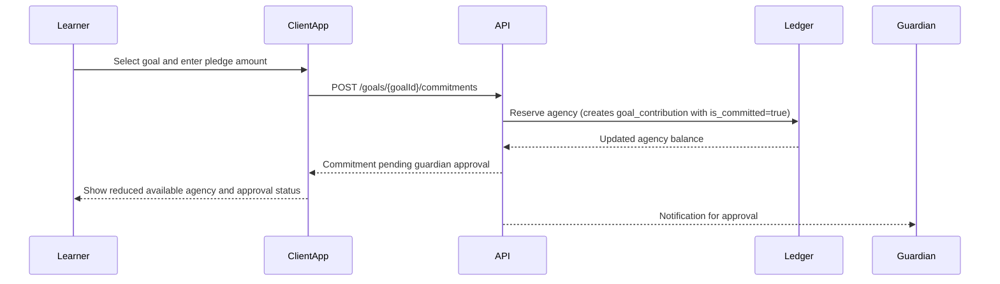
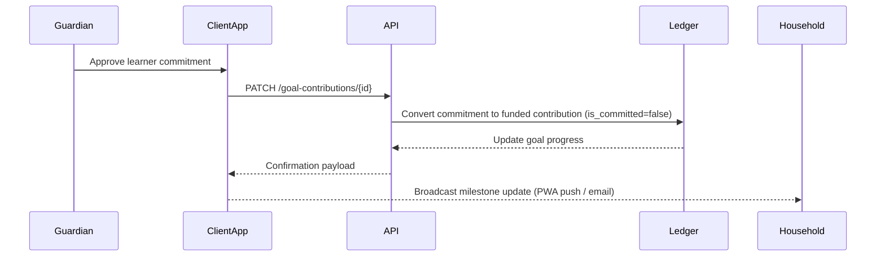

# Savings Goals Feature Specification

## Overview
Savings goals allow guardians and learners to plan longer-term purchases or cash reserves while reinforcing the "agency" mindset. Goals can be owned by adults, shared with the household, or co-managed with learners who contribute earned agency that guardians later fulfill with real funds.

## User Stories

### Guardians / Adults
- **As a** guardian, **I want** to create a named savings goal (e.g., "Emergency Fund" or "Save 2k") **so that** our household has visibility into long-term objectives.
- **As a** guardian, **I want** to map specific income sources to goals **so that** a percentage of each paycheck or side income contributes automatically.
- **As a** guardian, **I want** to see learner commitments alongside my cash funding **so that** I can match or cover their contributions once earned.
- **As a** guardian, **I want** to approve learner goal commitments **so that** I can coach them before the pledge reduces their available agency.

### Learners
- **As a** learner, **I want** to pledge part of my agency balance toward a shared goal **so that** I can practice delayed gratification and teamwork.
- **As a** learner, **I want** progress feedback (percent complete, projected completion date) **so that** I stay motivated to complete tasks and earn more agency.
- **As a** learner in allowance mode, **I want** chores to list how much agency I still need to earn for a goal **so that** I can pick the right tasks.

### Household / Shared Experience
- **As a** family, **we want** leaderboards or shout-outs when goals hit milestones **so that** everyone celebrates progress together.
- **As a** household, **we want** reminders when a goal is off-track relative to its target date **so that** we can adjust contributions or scope.

## Data Model Implications
- `savings_goals` table:
  - `id`, `household_id`, `name`, `target_amount`, `currency`, `target_date`, `owner_profile_id`, `visibility`, `status`, `auto_contribution_rule`, `created_at`, `updated_at`.
  - `auto_contribution_rule` supports flat amounts or percentage-of-income formula with optional cap per recurrence.
- `goal_contributions` table extends the ledger:
  - Links to `savings_goals` and optionally a `profile_id` when a learner is pledging.
  - Tracks `amount`, `currency`, `source_type`, `is_committed`, `occurred_at`, `notes`.
  - Stores `matched_by_user_id` for guardian-backed commitments once fulfilled.
- `income_sources.auto_contribute_goal_id` references a default goal for scheduled contributions.
- `agency_ledger` must annotate when a transaction is a goal commitment to avoid double counting.

## Workflows

### Creating a Goal
```mermaid
description
sequenceDiagram
  participant Guardian
  participant ClientApp
  participant API
  participant DB

  Guardian->>ClientApp: Open "New Goal" form
  ClientApp->>Guardian: Prompt for name, target, visibility, target date
  Guardian->>ClientApp: Submit form with optional auto-contribution rule
  ClientApp->>API: POST /goals
  API->>DB: Insert savings_goals row
  API-->>ClientApp: 201 Created with goal payload
  ClientApp-->>Guardian: Show goal dashboard tile
```

### Learner Commits Agency to a Goal


### Guardian Fulfills Commitment


## Notifications
- Push/email reminders when:
  - A commitment has waited longer than `guardian_approval_sla` (configurable) without action.
  - A goal drifts behind schedule based on target date and average contribution cadence.
  - A goal crosses 25%, 50%, 75%, or 100% of target.

## Analytics Hooks
- Emit events for `goal.created`, `goal.commitment.pending`, `goal.commitment.funded`, and `goal.target.met`.
- Learner dashboards should overlay goal progress vs. agency earning rate to forecast completion.
- Household analytics should surface monthly contribution totals per goal for budgeting insights.

## Open Questions
- Should learners in allowance mode require guardian approval for every commitment, or can a per-goal auto-approval threshold exist?
- How do we handle currency differences if a goal is denominated in a different currency than the household default?
- What happens to partially funded commitments when a goal is archived or deleted?
